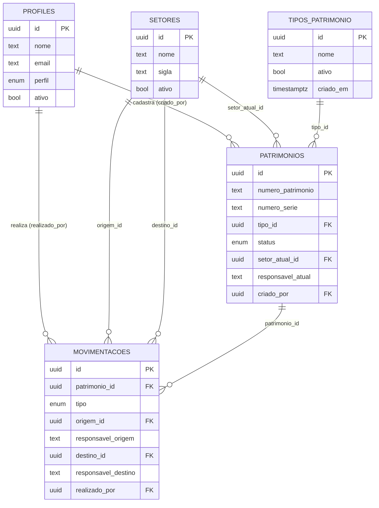

# Banco de dados do InvTec

Modelo definido em
[`supabase/migrations/20260910120000_initial_schema.sql`](../supabase/migrations/20260910120000_initial_schema.sql).

> A migration **ainda não foi aplicada** no Supabase remoto e **não foi
> executada em nenhum PostgreSQL local** (não há Postgres/Docker/WSL nesta
> máquina). Toda a validação até aqui foi revisão manual.

## Visão geral



| Tabela | Papel |
|---|---|
| `profiles` | Perfil de aplicação 1:1 com `auth.users`. Sem senha própria. |
| `setores` | Locais/gerências (GETEC, GEVEV, Almoxarifado, Assistência Técnica…). |
| `tipos_patrimonio` | Categorias (tabela, e não enum, porque crescem com o tempo). Seedada com 10 valores. |
| `patrimonios` | Cadastro de cada equipamento. Nunca apagado. |
| `movimentacoes` | Histórico imutável. Só recebe `INSERT`, e só pelas RPCs. |

`movimentacao_tipo`, `patrimonio_status` e `perfil_usuario` continuam enum:
são regras do sistema, com lógica correspondente nas RPCs.

---

## Controle de acesso

### Autorização sem armadilha de `NULL`

Toda checagem de permissão — nas RPCs e nas policies — usa
`public.has_perfil(...)`:

```sql
select exists (
  select 1 from public.profiles p
  where p.id = auth.uid() and p.ativo is true and p.perfil = any (p_perfis)
);
```

`EXISTS` retorna sempre `true` ou `false`, nunca `NULL`. Por isso:

| Situação | `has_perfil(...)` |
|---|---|
| sem sessão (`auth.uid()` nulo) | `false` |
| autenticado sem profile | `false` |
| profile inativo | `false` |
| profile ativo sem o papel pedido | `false` |
| profile ativo com o papel pedido | `true` |

As RPCs ainda testam `if has_perfil(...) is not true then raise`, que nega
mesmo se, por algum erro futuro, o valor vier `NULL`.

A versão anterior usava `current_profile_perfil() not in (...)`. Para um
usuário sem profile isso resultava em `NULL`, o `IF` não disparava e a
execução **seguia autorizada** — era um bypass real. `current_profile_perfil`
foi removida.

A mesma armadilha existe em `CHECK` (um CHECK que avalia para `NULL` é
aprovado). Os CHECKs de normalização usam `is not distinct from` por isso.

### O que cada situação consegue fazer

| | profiles | setores / tipos | patrimonios | movimentacoes | RPCs |
|---|---|---|---|---|---|
| `anon` | nada | nada | nada | nada | nada |
| autenticado sem profile | nada | nada | nada | nada | negado |
| profile **inativo** | lê só o próprio | nada | nada | nada | negado |
| `CONSULTA` | lê o próprio; edita o próprio `nome` | lê | lê | lê | negado |
| `OPERADOR` | idem | lê | lê; edita metadados | lê | cadastra e movimenta |
| `GESTOR` | lê todos; edita o próprio `nome` | lê; cria; edita/desativa | idem OPERADOR | lê | idem OPERADOR |
| `ADMIN` | idem GESTOR | idem GESTOR | idem OPERADOR | lê | idem OPERADOR |

Hoje ADMIN e GESTOR têm os mesmos poderes no banco. A diferença virá com o
fluxo administrativo de usuários (ativar, trocar perfil), ainda não
implementado — até lá, isso é feito pelo SQL Editor.

Nenhum papel escreve diretamente em `movimentacoes`, nem altera
`status`/`setor_atual_id`/`responsavel_atual`.

### Novos usuários

Todo usuário criado no Supabase Auth recebe automaticamente (trigger
`handle_new_user`) um profile com `perfil = CONSULTA` e **`ativo = false`**.
Ele consegue autenticar, mas não enxerga nenhum dado até um ADMIN ativá-lo.
O app pode ler o próprio profile para exibir "Seu acesso ao InvTec está
desativado".

**Ao configurar o projeto remoto:** desabilitar o cadastro público no
Supabase Auth (Authentication → Sign In / Providers → desmarcar "Allow new
users to sign up"). Usuários serão criados/convidados pelo dashboard.

### Bootstrap do primeiro ADMIN

Não há ID nem email fixo na migration. Depois de aplicá-la:

1. Criar o primeiro usuário no Supabase Auth (dashboard → Authentication →
   Add user).
2. O profile é criado automaticamente como `CONSULTA` / inativo.
3. No SQL Editor, **uma única vez**:

   ```sql
   update public.profiles
   set perfil = 'ADMIN', ativo = true
   where email = 'email-do-primeiro-admin@exemplo';
   ```

Isso funciona porque o SQL Editor executa como dono do banco. A trigger
`protect_profile_columns` só bloqueia alterações vindas dos papéis `anon` e
`authenticated` (a API usada pelo app).

### Proteção de `profiles`

- `GRANT UPDATE` apenas na coluna `nome`, e a policy só permite a própria
  linha, com profile ativo.
- Sem `GRANT INSERT` (feito pela trigger) e sem `DELETE` (usar `ativo`).
- Defesa em profundidade: a trigger `protect_profile_columns` rejeita
  mudança de `id`, `email`, `perfil`, `ativo` e `criado_em` feita pelos
  papéis do cliente, mesmo que um `GRANT` amplo seja aplicado por engano no
  futuro (ex.: `grant all on all tables in schema public to authenticated`,
  snippet comum). Ninguém se autopromove.

### Usuários do InvTec devem ser desativados, e não excluídos

`profiles.id` referencia `auth.users.id` com **`ON DELETE RESTRICT`** (era
`CASCADE`). Isso significa que o PostgreSQL **recusa** apagar um usuário do
Supabase Auth enquanto o profile correspondente existir — e como
`handle_new_user` cria um profile para todo usuário automaticamente, na
prática **nenhum usuário pode ser excluído** pelo dashboard, pela Admin API
ou por SQL direto; a tentativa falha com violação de chave estrangeira.

Isso é intencional: `patrimonios.criado_por` e `movimentacoes.realizado_por`
são `NOT NULL` e referenciam `profiles.id` também com `ON DELETE RESTRICT`
— ou seja, eles **sempre** apontam para um profile de verdade, nunca viram
`NULL` nem viram texto solto. Excluir um usuário destruiria essa
rastreabilidade (quem cadastrou, quem realizou cada movimentação); com
`RESTRICT` em toda a cadeia, isso é impossível mesmo por engano.

O procedimento correto para alguém que sai da equipe é **desativar**, nunca
excluir:

```sql
update public.profiles set ativo = false where id = '...';
```

Isso já é suficiente: `has_perfil()` passa a negar tudo para esse usuário
(ver "Perfil inativo"), sem apagar nada do histórico. Se também for
necessário impedir login, desativar o usuário no Supabase Auth (sem
excluí-lo) tem o mesmo efeito sem violar a FK.

### Sincronização de email

`profiles.email` é uma cópia do email do Supabase Auth, útil para a futura
administração de usuários sem precisar consultar o schema `auth`
diretamente. A trigger `trg_auth_users_sync_email` (`AFTER UPDATE OF email
ON auth.users`) mantém essa cópia atualizada: sempre que o email muda no
Auth — pelo próprio usuário, pelo dashboard, ou por qualquer fluxo do
Supabase — `handle_user_email_updated()` propaga o novo valor para
`profiles.email` na mesma transação.

A função é `SECURITY DEFINER` com `search_path` fixado, só copia
`new.email` para a linha de `new.id` (nenhum dado vindo do cliente é
usado) e funciona também para o bootstrap: como ela reage a mudanças em
`auth.users`, não interfere na criação inicial do profile
(`handle_new_user`, disparada por `INSERT`, não por `UPDATE`) nem na
promoção manual do primeiro ADMIN pelo SQL Editor (que só toca
`perfil`/`ativo`, não `email`). O cliente continua sem nenhuma permissão de
`UPDATE` sobre `profiles.email`.

### Grants

A migration primeiro **revoga tudo** de `public`, `anon` e `authenticated`
em todas as tabelas e funções, e só depois concede o necessário. Isso
importa: projetos Supabase podem ter default privileges que dão grants
**explícitos** a `anon`/`authenticated` em objetos novos — `revoke ... from
public` não os remove, e `grant select` não reduz um `all` já concedido.

| Objeto | `authenticated` |
|---|---|
| `profiles` | `SELECT`; `UPDATE (nome)` |
| `setores` | `SELECT`; `INSERT (nome, sigla, descricao)`; `UPDATE (nome, sigla, descricao, ativo)` |
| `tipos_patrimonio` | `SELECT`; `INSERT (nome, descricao)`; `UPDATE (nome, descricao, ativo)` |
| `patrimonios` | `SELECT`; `UPDATE (numero_patrimonio, numero_serie, tipo_id, marca, modelo, descricao, observacao, data_aquisicao)` |
| `movimentacoes` | `SELECT` |
| funções | `EXECUTE` em `normalize_text`, `has_perfil`, `cadastrar_patrimonio`, `registrar_movimentacao` |

`id` e `criado_em` nunca são graváveis pelo cliente. `anon` não tem nenhum
privilégio. `service_role` não é tocado — contorna RLS por definição e
jamais pode existir no app.

`normalize_text` precisa de `EXECUTE` porque é usada em CHECKs, avaliados
com o privilégio de quem grava; `has_perfil`, porque é usada nas policies.
Ambas são inofensivas se chamadas diretamente.

### Funções `SECURITY DEFINER`

Todas as funções do arquivo (definer ou não) usam **`set search_path = ''`**
e referenciam tudo com schema explícito (`public.*`, `auth.uid()`). Funções
nativas (`now`, `btrim`, `upper`, `count`) vêm de `pg_catalog`, que o
PostgreSQL sempre consulta. Nenhum schema gravável por usuário não
confiável entra no `search_path`.

| Função | Por que precisa ser definer | Proteção |
|---|---|---|
| `has_perfil` | ler `profiles` a partir de policies de `profiles` sem recursão | só lê a linha de `auth.uid()` |
| `handle_new_user` | cliente não tem `INSERT` em `profiles` | trigger (não chamável via RPC); força CONSULTA/inativo |
| `handle_user_email_updated` | cliente não tem `UPDATE` de `email` em `profiles` | trigger (não chamável via RPC); só copia `new.email` para a linha correspondente |
| `cadastrar_patrimonio` | cliente não tem `INSERT` em `patrimonios`/`movimentacoes` | `has_perfil` explícito no início |
| `registrar_movimentacao` | cliente não tem `INSERT` em `movimentacoes` nem `UPDATE` de status/setor/responsável | `has_perfil` explícito no início |
| `prevent_deactivate_setor_em_uso` | contar **todos** os patrimônios, independente da RLS do chamador | trigger (não chamável via RPC) |
| `validate_tipo_patrimonio_ativo` | `FOR SHARE` exige passar pela policy de `UPDATE` de tipos, que OPERADOR não tem | trigger (não chamável via RPC) |

Nenhuma RPC aceita `criado_por`, `realizado_por`, `criado_em`,
`atualizado_em` ou a origem de uma movimentação existente: tudo vem de
`auth.uid()`, `now()` e do estado do banco.

---

## Normalização

Feita no banco (triggers `BEFORE INSERT/UPDATE`) e garantida por `CHECK` —
mesmo se uma trigger for removida, dado fora do padrão é rejeitado.

| Campo | Regra | Unicidade |
|---|---|---|
| `patrimonios.numero_patrimonio` | trim (espaço/tab/CR/LF), vazio → `NULL`, **maiúsculas** | única (valor já normalizado) |
| `patrimonios.numero_serie` | trim, vazio → `NULL` | não única |
| `patrimonios.responsavel_atual`, responsáveis nas RPCs | trim, vazio → `NULL` | — |
| `setores.nome` | trim | única **case-insensitive** (`lower(nome)`) |
| `setores.sigla` | trim, vazio → `NULL`, maiúsculas | única |
| `tipos_patrimonio.nome` | trim | única case-insensitive |

`numero_patrimonio` é `text`, nunca inteiro: `"00045872"` continua
`"00045872"`. `"45872 "` vira `"45872"`; `"abc123"` vira `"ABC123"`.

O Dart tem `normalizarNumeroPatrimonio()` com a mesma regra, usada na busca
exata por número (sem ela, `"abc123"` não encontraria `"ABC123"`).

Limitação conhecida: acentos não são normalizados (`Manutenção` e
`Manutencao` seriam setores diferentes).

---

## Cadastro inicial

```sql
cadastrar_patrimonio(
  p_tipo_id uuid,                              -- obrigatório
  p_destino_id uuid,                           -- obrigatório: onde o patrimônio fica
  p_numero_patrimonio text default null,
  p_numero_serie text default null,
  p_marca text default null,
  p_modelo text default null,
  p_descricao text default null,
  p_observacao text default null,
  p_data_aquisicao date default null,
  p_origem_id uuid default null,               -- de onde veio (ex.: Almoxarifado)
  p_responsavel_origem text default null,
  p_responsavel_destino text default null,     -- vira o responsável atual
  p_motivo text default null,
  p_observacao_movimentacao text default null,
  p_data_movimentacao timestamptz default null -- nulo = agora
) returns patrimonios
```

Em uma única transação:

1. `has_perfil('ADMIN','GESTOR','OPERADOR')`, senão nega;
2. valida `tipo_id`/`destino_id` e a data;
3. trava o tipo com `FOR SHARE` e exige `ativo`;
4. trava o destino com `FOR SHARE` e exige `ativo`; se houver origem, ela
   precisa existir (pode estar inativa, é referência histórica) e ser
   diferente do destino;
5. checagem amigável de número duplicado (a defesa real é o índice único);
6. cria o patrimônio com `setor_atual_id = destino`,
   `responsavel_atual = responsavel_destino` e status `EM_USO` se houver
   responsável, `DISPONIVEL` se não houver;
7. cria a movimentação `ENTRADA` com os dados de origem e destino;
8. retorna o patrimônio.

`p_responsavel_atual` foi removido: o responsável atual é, por definição, o
responsável de destino. Não existe mais trigger de ENTRADA automática.

Aqui a origem vem do cliente porque o patrimônio ainda não existe no InvTec.

---

## Movimentações de patrimônios existentes

```sql
registrar_movimentacao(
  p_patrimonio_id uuid,
  p_tipo movimentacao_tipo,
  p_destino_id uuid default null,
  p_responsavel_destino text default null,
  p_motivo text default null,
  p_observacao text default null,
  p_numero_documento text default null,
  p_numero_chamado text default null,
  p_data_movimentacao timestamptz default null
) returns movimentacoes
```

`p_origem_id` e `p_responsavel_origem` foram **removidos**. A função trava o
patrimônio com `SELECT ... FOR UPDATE` e grava como origem o estado que
estava no banco **antes** da movimentação:

| Coluna da movimentação | Valor |
|---|---|
| `origem_id` | `setor_atual_id` antes |
| `responsavel_origem` | `responsavel_atual` antes |
| `destino_id` | `setor_atual_id` depois (`NULL` em BAIXA) |
| `responsavel_destino` | `responsavel_atual` depois (`NULL` em BAIXA) |
| `realizado_por` | `auth.uid()` |

Assim o histórico sempre registra quem/onde estava antes e quem/onde passou
a estar, sem origem nula, falsa ou divergente do estado real.

### Regra de status após deslocamento

Para `ENTRADA`, `SAIDA`, `TRANSFERENCIA`, `DEVOLUCAO` e `RETORNO_MANUTENCAO`
(e para o cadastro):

- responsável de destino preenchido → `EM_USO`
- responsável vazio, só espaços ou ausente → `DISPONIVEL`

Um `CHECK` em `patrimonios` garante que isso nunca se contradiz:
`DISPONIVEL` exige responsável nulo; `EM_USO` e `EMPRESTADO` exigem
responsável preenchido; `EM_MANUTENCAO` e `BAIXADO` aceitam ambos.

### Matriz de transição

Status atual (linhas) × tipo de movimentação (colunas). ✅ permitido, ❌ rejeitado.

| | ENTRADA | SAIDA | TRANSF. | ALT. RESP. | EMPRÉST. | DEVOL. | MANUT. | RET. MANUT. | BAIXA | AJUSTE |
|---|---|---|---|---|---|---|---|---|---|---|
| **DISPONIVEL** | ✅ | ✅ | ✅ | ✅ | ✅ | ❌ | ✅ | ❌ | ✅ | ✅ |
| **EM_USO** | ✅ | ✅ | ✅ | ✅ | ✅ | ❌ | ✅ | ❌ | ✅ | ✅ |
| **EMPRESTADO** | ❌ | ❌ | ❌ | ❌ | ❌ | ✅ | ❌ | ❌ | ✅ | ✅ |
| **EM_MANUTENCAO** | ❌ | ❌ | ❌ | ❌ | ❌ | ❌ | ❌ | ✅ | ✅ | ✅ ¹ |
| **BAIXADO** | ❌ | ❌ | ❌ | ❌ | ❌ | ❌ | ❌ | ❌ | ❌ | ✅ ² |

- Um item `EMPRESTADO` só volta a circular por `DEVOLUCAO`; um item
  `EM_MANUTENCAO`, só por `RETORNO_MANUTENCAO`. `TRANSFERENCIA`, `ENTRADA`,
  `SAIDA` e `ALTERACAO_RESPONSAVEL` não servem de atalho.
- **BAIXA** é permitida a partir de qualquer status não baixado, inclusive
  `EMPRESTADO` e `EM_MANUTENCAO` — cobre equipamento perdido durante o
  empréstimo ou condenado na assistência técnica.
- **`ALTERACAO_RESPONSAVEL`** só se aplica a `DISPONIVEL`/`EM_USO` — um item
  `EMPRESTADO` já tem responsável formal via empréstimo (troca-se com
  `DEVOLUCAO` + novo `EMPRESTIMO`, não com esta movimentação).
- ¹ `AJUSTE_INVENTARIO` não muda status: o item continua `EM_MANUTENCAO`
  (ou `EMPRESTADO`), mas o setor pode ser corrigido.
- ² Em `BAIXADO`, ver seção própria abaixo.

### Regras por tipo

| Tipo | `destino_id` | `responsavel_destino` | Setor depois | Responsável depois | Status depois |
|---|---|---|---|---|---|
| `ENTRADA` | obrigatório, ≠ atual, ativo | opcional | destino | resp. destino | `EM_USO` / `DISPONIVEL` |
| `SAIDA` | obrigatório, ≠ atual, ativo | opcional | destino | resp. destino | `EM_USO` / `DISPONIVEL` |
| `TRANSFERENCIA` | obrigatório, ≠ atual, ativo | opcional | destino | resp. destino | `EM_USO` / `DISPONIVEL` |
| `EMPRESTIMO` | obrigatório, ≠ atual, ativo | **obrigatório** | destino | resp. destino | `EMPRESTADO` |
| `DEVOLUCAO` | obrigatório, ≠ atual, ativo | opcional | destino | resp. destino | `EM_USO` / `DISPONIVEL` |
| `MANUTENCAO` | obrigatório, ≠ atual, ativo | opcional | destino | resp. destino | `EM_MANUTENCAO` |
| `RETORNO_MANUTENCAO` | obrigatório, ≠ atual, ativo | opcional | destino | resp. destino | `EM_USO` / `DISPONIVEL` |
| `BAIXA` | **proibido** | **proibido** | preservado | preservado | `BAIXADO` |
| `AJUSTE_INVENTARIO` | opcional (= atual permitido) | **proibido** | destino ou preservado | preservado | preservado |
| `ALTERACAO_RESPONSAVEL` | **proibido** | **obrigatório**, ≠ atual | preservado (= setor atual) | resp. destino | `EM_USO` |

`EMPRESTIMO` exige responsável: um empréstimo sem ninguém com o equipamento
seria uma informação contraditória (e o CHECK de coerência rejeitaria). Essa
regra foi confirmada nesta revisão e não deve ser alterada sem decisão
explícita.

Exemplo — GETEC → Assistência Técnica com `MANUTENCAO`: após a transação,
`setor_atual_id = Assistência Técnica` **e** `status = EM_MANUTENCAO`,
alterados juntos.

### BAIXA

- Status resultante: `BAIXADO`.
- `setor_atual_id` e `responsavel_atual` **preservados**: são o último local
  e o último responsável conhecidos.
- `destino_id` e `responsavel_destino` são proibidos (não há destino). Na
  movimentação gravada, origem = último setor/responsável; destino = `NULL`.
- Depois da baixa, só `AJUSTE_INVENTARIO` é aceito, com as restrições
  abaixo. Nenhuma movimentação comum devolve o item à circulação.
- **Reativação não existe nesta versão.** Quando for necessária, deverá ser
  uma função administrativa explícita (ex.: restrita a ADMIN, com motivo
  obrigatório), e não um efeito colateral de outro tipo.

### AJUSTE_INVENTARIO

Serve para registrar conferência ou corrigir erro de registro.

- Nunca altera `status` nem `responsavel_atual`.
- Aceita `origem = destino` (caso típico: "conferi, está onde já estava").
- Se o destino for um setor diferente do atual, ele precisa estar ativo, e o
  setor é corrigido.
- **Em patrimônio `BAIXADO`:** registra a observação/correção histórica, mas
  não altera nada. `destino_id` só é aceito se for nulo ou igual ao último
  setor; qualquer outro valor é rejeitado.

### ALTERACAO_RESPONSAVEL

Caso real: o patrimônio continua no mesmo setor, só muda quem é o
responsável (ex.: 45872 continua na GETEC, mas passa de João para Maria).
Diferente dos outros tipos, **não representa deslocamento físico**.

- `destino_id` **não é aceito** — o setor não muda por definição, então não
  há "para onde" a informar. Enviar qualquer valor é rejeitado.
- `responsavel_destino` é **obrigatório** e precisa ser diferente do
  `responsavel_atual` do patrimônio (comparados já normalizados); do
  contrário a chamada seria um evento sem efeito nenhum, e é rejeitada.
- `responsavel_origem`, como em qualquer outra movimentação, vem sempre do
  banco (`v_patrimonio.responsavel_atual` antes da mudança) — o Flutter não
  informa.
- Só é permitida quando o patrimônio está `DISPONIVEL` ou `EM_USO` (ver
  matriz). Não pode ser usada em `EMPRESTADO` (o responsável formal muda por
  `DEVOLUCAO` + novo `EMPRESTIMO`, não por esta movimentação) nem em
  `EM_MANUTENCAO`/`BAIXADO`.
- Resultado: `setor_atual_id` inalterado, `responsavel_atual` = novo
  responsável, `status = EM_USO`. Na movimentação gravada, `origem_id` e
  `destino_id` ficam com o **mesmo** setor — registrando explicitamente que
  a localização não mudou, só o responsável.

### Datas

- `p_data_movimentacao` nulo = relógio do servidor. Em
  `registrar_movimentacao`, esse valor é lido com `clock_timestamp()`
  **depois** de obter a trava do patrimônio. `now()` não serviria: ele marca o
  início da transação, e uma movimentação que esperou outra concorrente
  terminar ficaria datada antes dela, sendo rejeitada pela regra
  cronológica.
- Datas até 5 minutos no futuro são aceitas e limitadas ao relógio do
  servidor (tolerância para relógio do dispositivo adiantado); além disso,
  rejeitadas.
- Uma movimentação não pode ser datada **antes** da última movimentação do
  mesmo patrimônio. Como a origem é o estado atual, uma data retroativa
  anterior geraria um histórico impossível. Registro retroativo é possível
  desde que respeite a ordem.
- `criado_em` (momento do registro) é sempre do banco.

---

## Histórico imutável

Garantido em duas camadas independentes:

1. `authenticated` só tem `SELECT` em `movimentacoes`.
2. Não existe policy de `INSERT`/`UPDATE`/`DELETE` — RLS nega por padrão.

Só `cadastrar_patrimonio` e `registrar_movimentacao` inserem. Correção de
erro = nova movimentação `AJUSTE_INVENTARIO`, nunca edição da antiga.

## Setores inativos

- Continuam existindo e aparecendo em movimentações antigas. As FKs usam
  `ON DELETE RESTRICT`; não há `DELETE` para o cliente.
- Não podem ser **destino** de nova movimentação ou cadastro (validado nas
  RPCs, nunca por CHECK).
- Podem ser **origem** no cadastro (referência histórica).
- **Não podem ser desativados** enquanto houver patrimônio não baixado com
  `setor_atual_id` apontando para eles (trigger
  `prevent_deactivate_setor_em_uso`). Setor com apenas itens baixados pode
  ser desativado.

`tipos_patrimonio` pode ser desativado mesmo com uso histórico. Não pode ser
usado em novo cadastro nem em troca direta de `tipo_id`
(`validate_tipo_patrimonio_ativo`).

## Concorrência

| Corrida | Proteção |
|---|---|
| Duas movimentações no mesmo patrimônio | `SELECT ... FOR UPDATE` no patrimônio: a segunda espera e lê o estado já atualizado (origem, status e matriz reavaliados). |
| Movimentar para setor X × desativar X | RPC trava X com `FOR SHARE`; o `UPDATE` do setor precisa de trava incompatível. Se a RPC chega antes, a desativação espera e sua trigger (snapshot novo) enxerga o patrimônio em X e rejeita. Se a desativação chega antes, a RPC espera e lê `ativo = false`. |
| Cadastrar com tipo T × desativar T | `FOR SHARE` em T no cadastro; mesma lógica. Não bloqueia desativar tipo com uso histórico. |
| Editar `tipo_id` para T × desativar T | `FOR SHARE` na trigger `validate_tipo_patrimonio_ativo`. |
| Dois cadastros com o mesmo número | Checagem amigável + índice único sobre o valor normalizado. O perdedor recebe violação de unicidade e a transação inteira (patrimônio + ENTRADA) é revertida. |

## Índices

| Índice | Motivo |
|---|---|
| `patrimonios_numero_patrimonio_key` (único, parcial) | Busca por número; unicidade normalizada. |
| `patrimonios_numero_serie_idx` (parcial) | Busca por série. |
| `patrimonios_tipo_idx`, `_setor_atual_idx`, `_status_idx` | Filtros de listagem. |
| `movimentacoes_patrimonio_data_idx` | Histórico de um patrimônio por data; checagem de data mínima na RPC. |
| `movimentacoes_data_idx` | Atividade recente geral. |
| `setores_nome_key`, `tipos_patrimonio_nome_key` (`lower(nome)`) | Unicidade case-insensitive. |
| `setores_sigla_key` | Unicidade de sigla. |

## Exclusão lógica

| Entidade | Estratégia |
|---|---|
| `patrimonios` | Nunca apagado; `BAIXADO` encerra o ciclo. |
| `setores` | `ativo`; desativação bloqueada se houver item não baixado. |
| `tipos_patrimonio` | `ativo`. |
| `profiles` | `ativo`; nasce `false`. |
| `movimentacoes` | Nunca apagada nem editada. |

## Responsáveis em texto

`responsavel_atual`, `responsavel_origem` e `responsavel_destino` são texto
livre, por decisão explícita:

1. nem todo responsável tem login no InvTec;
2. o texto congela o nome como era no momento da movimentação — uma FK para
   pessoa renomeada mudaria retroativamente o histórico.

Se surgir necessidade real (relatórios por colaborador, integração com RH),
a evolução natural é uma entidade própria de pessoas/servidores, separada de
`profiles`, mantendo o texto histórico já gravado.

---

## Riscos e decisões pendentes

1. **SQL nunca executado.** A migration só passou por revisão manual. Antes
   de aplicar no remoto, recomenda-se rodá-la num Postgres descartável
   (ex.: `supabase start` local) e testar os cenários de permissão e
   transição, incluindo `ALTERACAO_RESPONSAVEL` e a impossibilidade de
   excluir um usuário com profile.
2. **Reativação de `BAIXADO`** e **gestão de usuários pelo app** ainda não
   existem (hoje só pelo SQL Editor).
3. **Excluir um usuário do Supabase Auth passa a falhar sempre** (FK
   `RESTRICT`), inclusive pela Admin API. Isso é intencional (ver
   "Usuários do InvTec devem ser desativados, e não excluídos"), mas é uma
   mudança de comportamento que qualquer integração futura (ex.: exclusão
   de conta solicitada pelo usuário, LGPD) precisa levar em conta —
   "excluir" deixa de ser uma operação disponível; o caminho passa a ser
   sempre desativação.

### Confirmado nesta revisão (não são mais riscos em aberto)

- **Reatribuir responsável sem mudar de setor** agora tem um fluxo próprio:
  `ALTERACAO_RESPONSAVEL`.
- **`EMPRESTIMO` exige `responsavel_destino`** — confirmado, não alterar sem
  decisão explícita.
- **Ordem cronológica obrigatória** das movimentações — confirmado que
  fica assim nesta versão; um fluxo administrativo de importação histórica
  (que pularia essa checagem) fica para quando for realmente necessário, e
  não deve ser implementado antecipadamente.
- **`profiles.email` desatualizado** — resolvido pela trigger
  `trg_auth_users_sync_email`.
- **Perda de autoria ao excluir usuário** — resolvido pela troca de
  `ON DELETE CASCADE` para `ON DELETE RESTRICT` em toda a cadeia
  (`profiles.id`, `criado_por`, `realizado_por`).
